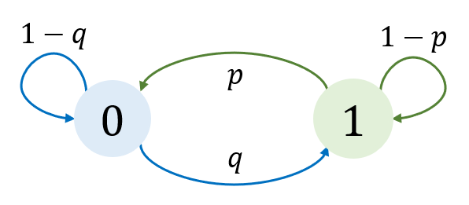
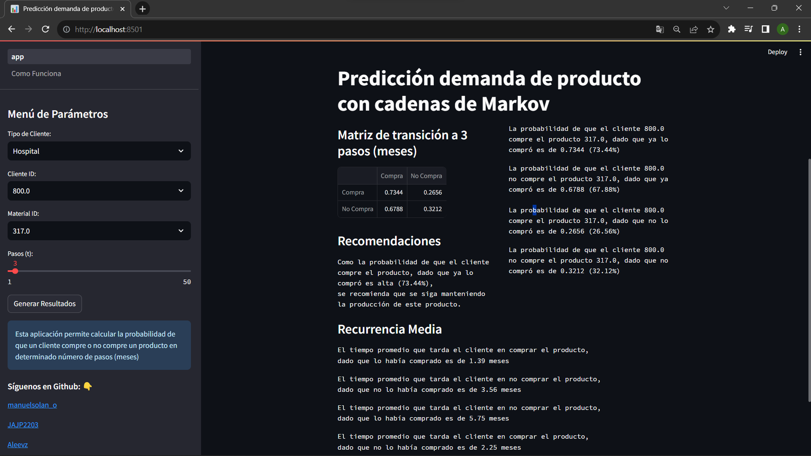
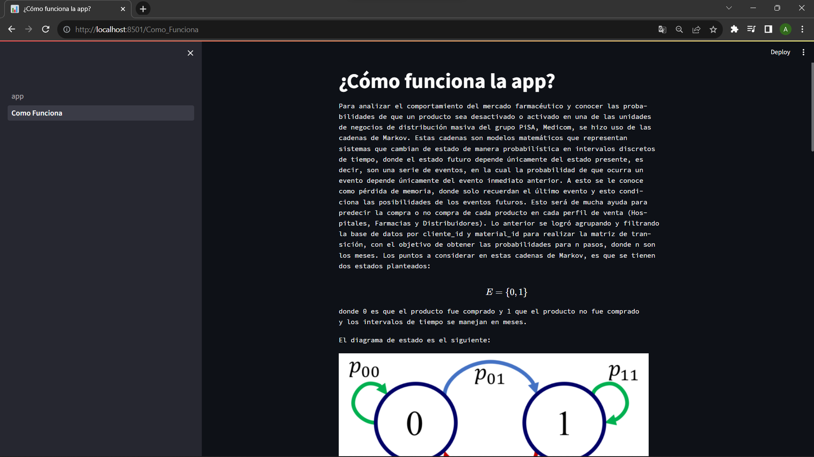

\newpage


\tableofcontents  

\newpage  


## Introducción

La demanda de medicamentos ha experimentado una evolución significativa a lo largo de la historia. Desde las prácticas de medicina tradicional y
herbolaria en tiempos antiguos, hasta el desarrollo de la farmacología moderna. La expansión de la investigación y el desarrollo farmacéutico
ha llevado a la creación de una amplia gama de medicamentos para diversas enfermedades. Este incremento en los medicamentos coloca a las empresas farmacéuticas en situaciones de incertidumbre, ya que desconocen cuando la demanda de un medicamento disminuye o cuando aumenta. Esta falta de información puede ocasionar pérdidas económicas que representan un gran impacto negativo. De ahí nace la necesidad de analizar el comportamiento en el mercado farmacéutico, para conocer las probabilidades de que un producto sea desactivado o activado.

## Objetivo

El objetivo de este proyecto es analizar la probabilidad de que cada cliente deje comprar cada producto y si los producto estuvieran desactivados, conocer la probabilidad de que el cliente vuelva a comprar estos productos. Por otra parte, se busca analizar los datos para generar diversas hipótesis y así conocer los diferentes patrones y comportamientos de los clientes.

## Contexto

*PiSA Farmacéutica* es una empresa 100% mexicana, fundada en 1946, que se dedica a desarrollar productos y servicios integrales para los segmentos de salud pública y privada en México, Estados Unidos, Latinoamérica y el Caribe. El crecimiento de PiSA Farmacéutica ha sido una constante durante lo largo de los años y se les distingue por su gran capacidad de producción y amplia experiencia en el mercado, lo cuál les ha permitido marcar la pauta para su crecimiento y expansión internacional. Una de las unidades de negocios de grupo PiSA de distribución masiva a la parte más fragmentada del mercado es Medicom. Medicom se dedica a vender medicamentos y productos de salud a hospitales (clínicas), farmacias y distribuidores. Los comportamientos de los 3 perfiles de venta de Medicom son:

-   Hospitales (clínicas): Se venden productos para atención de los pacientes, son compras recurrentes y en menor cantidad, por lo tanto la competencia es menor.
-   Farmacias: Los productos que se venden son para consumo en casa, por lo cual su compra es recurrente, en menor cantidad y hay mayor competencia.
-   Distribuidores: se surten productos a clínicas y farmacias, por ende, las compras son menos recurrentes pero en grandes cantidades.

El 80% de los clientes de Medicom representan el 20 % del consumo del mercado y cuenta con más de 4,000 clientes a nivel nacional. Debido al gran impacto que tiene Medicom en PiSA, surge la necesidad de analizar el comportamiento de oferta y demanda de los productos de PiSA para conocer la probabilidad de activación y desactivación de los productos.

## Marco teórico

### Cadena de Markov

Para lograr el objetivo propuesto por el socio formador se utilizaron las Cadenas de Markov. El proceso estocástico que consiste de un número finitos de estados en la cual la probabilidad de que ocurra un evento depende solamente del evento inmediatamente anterior con unas probabilidades que están fijas se conoce como una cadena de Markov.

### Espacio de estados y probabilidades de transición

Estas cadenas constan de un espacio de estados, que son el conjunto de posibles valores que pueden tomar las variables aleatorias del proceso estocástico de Markov $\mathcal{E}$. Además de las probabilidades de transición, que son las probabilidades de pasar de un estado $i$ aun
estado $j$ en un paso: $\mathbb{P}(X_{t+1}=j \: |\: X_t = i)$.Y un proceso a tiempo discreto es una cadena de Markov si y sólo si su espacio de estados es discreto y se cumple la propiedad de Markov, esto es:

$$
\mathbb{P}(X_{t+1}=x_{t+1} \: |\: X_t = x_t , ..., X_0 =x_0)=\mathbb{P}(X_{t+1}=x_{t+1}\:|\:X_t=x_t)
$$

$\forall \: t\geq 0 \:\: \text{y} \:\: x_0,...,x_{t+1} \in \mathcal{E}$.

### Matriz de transición

Una matriz de transición de una cadena de Markov es la matriz formada por todas las probabilidades de transición entre estados:

$$
\mathcal{P} =
\begin{bmatrix}
p_{00} & p_{01} & \ldots \\
p_{10} & p_{11} & \ldots \\
\vdots & \vdots & \ddots
\end{bmatrix}
$$

donde $p_{ij} = \mathbb{P}(X_1 =j \: | \: X_0 = i)$. Para que esta matriz de transición sea estocástica se debe de cumplir que $p_{ij} \geq 0$ para toda $i, j$ y $\sum_{j} p_{ij} = 1$, es decir, la suma de las probabilidades de la fila de la matriz es $1$. Si además, $\sum_i p_{ij} = 1$, entonces la matriz $\mathcal{P}$ es doblemente estocástica.

### Diagramas de transición

El espacio de estados y las probabilidades de transición de la cadena de Markov, se puede representar mediante grafos mejor conocidos como diagramas de transición. Por ejemplo, sea $\{X_n\}_{n=0}^\infty$ un proceso a tiempo discreto con espacio de estados $\mathcal{E} = \{0,1\}$. La probabilidad de ir al estado 0 dado que estaba en el estado 0 es de $1-q$ y la probabilidad de que vaya al estado 1 es de $q$. Por otro lado, la probabilidad de que el estado se quede en el 1 es de $1-p$ y la probabilidad de que se vaya del estado 1 al 0 es de $p$, donde $p, q \in (0,1)$. Con esta información la matriz de transición es:

$$
\mathcal{P} =
\begin{bmatrix}
1 - q & q \\
p & 1 - p
\end{bmatrix}
$$

Entonces, el diagrama de transición para este proceso tiene la siguiente forma:



### Distribución inicial

Una cadena de Markov a tiempo discreto tiene una distribución inicial del proceso que se le conoce como distribución $X_0$:

$$
\boldsymbol{\pi} = (\pi_0, \pi_1, ...) = (\mathbb{P}(X_0=x_0), \mathbb{P}(X_0 = x_1), ...)
$$ 

Este vector, representa las probabilidades de que $X_0$ tome cada uno de los estados.

### Matriz de transición en $n$-pasos:

Las cadenas de Markov no solo pueden obtener las probabilidades a un paso, si no que también puede obtener las probabilidades a $n$ pasos. En otras palabras, sea $\{X_n\}_{n=0}^\infty$ una cadena de Markov estacionaria, entonces la probabilidad de transición en $n$ pasos del estado $i$ al estado $j$ está dada por:

$$
\mathbb{P}(X_n = j \: |\: X_0 = i) = p_{ij}^{(n)}
$$ 

$\forall \: i, j \in \mathcal{E}$ y $n\geq 1$.

Además, para cualesquiera $i, j \in \mathcal{E}$ y $m, n \geq 0$ se cumple la ecuación de Champan-Kolmogorov:

$$
p_{ij}^{(m+n)} = \sum_{k\in \mathcal{E}} p_{ik}^{(m)}p_{kj}^{(n)}
$$ 


Con matriz de transición de este proceso estacionario $\mathcal{P}$ y el vector de probabilidades iniciales $\boldsymbol{\pi}$, la matriz de
transición a $n$ pasos ($\mathcal{P}^{(n)}$) es igual a la matriz $\mathcal{P}$ elevada a la $n$ potencia ($\mathcal{P}^n$): $\mathcal{P}^{(n)} = \mathcal{P}^n$ y la distribución de $X_n$ está dada por $\boldsymbol{\pi} \mathcal{P}^n$.

Esto es una gran herramienta para poder analizar el comportamiento de la demanda de productos farmacéuticos no solo en un mes, sino que se puede obtener las probabilidades de compra para $n$ meses. Un ejemplo, si se quisiera saber la probabilidad de compra en $6 \: \: meses$ de $x$ producto, bastaría solo con elevar la matriz de transición a la $6$.

### Descomposición espectral

Una manera sencilla de elevar una matriz a la potencia $n$ es mediante la descomposición espectral. Esto se refiere a, sea $\textbf{A} \in M^{p\times p} (\mathbb{R})$ con $p$ eigenvectores linealmente independientes, entonces $\textbf{A}$ puede factorizarse como:

$$
\textbf{A} = \textbf{Q} \boldsymbol{\Lambda} \textbf{Q}^{-1}
$$ 

donde $\textbf{Q}$ es una matriz de $p \times p$ cuya $i$-ésima columna es el eigenvector $\textbf{v}_i$, $\boldsymbol{\Lambda}$ es una matriz diagonal de ($p \times p$) cuyos elementos en la diagonal son los eigenvalores correspondientes, es decir, $\lambda_i$. Si $\textbf{A}$ puede diagonalizarse, entonces:

$$
\textbf{A}^n = \textbf{Q} \boldsymbol{\Lambda}^n \textbf{Q}^{-1}
$$ 

Esto es posible ya que $\boldsymbol{\Lambda}$ es diagonal, entonces solo basta con elevar a la $n$ cada entrada de su diagonal.

### Periodos de los estados

El periodo en una cadena de Markov se refiere a la cantidad de pasos de tiempo necesarios para que un estado dado en la cadena de Markov regrese a ese mismo estado con probabilidad positiva. En otras palabras, el periodo de un estado es el mayor común divisor (MCD) de los números enteros para los cuales la probabilidad de volver a ese estado en un número fijo de pasos de tiempo es mayor que cero. El periodo de un estado $i \in \mathcal{E}$ de una cadena se define como: 

$$
d(i):=
\left\{
\begin{array}{l}
MCD\{n \geq 1 \:| \: p_{ii}^{(n)} > 0 \}, \{n \geq 1 \:| \: p_{ii}^{(n)} > 0 \} \neq \emptyset \\
0\:\:\:\:\:\:\:\:\:\:\:\:\:\:\:\:\:\:\:\:\:\:\:\:\:\:\:\:\:\:\:\:\:\:\:\:\:\:\:\:\:\:\:\:, \{n \geq 1 \:| \: p_{ii}^{(n)} > 0 \} = \emptyset
\end{array}
\right.
$$
Se dice que un estado $i$ es aperiódico si $d(i) = 1$ y es de periodo $k$ si $d(i) = k \geq 2$. 

### Estados transitorios y recurrentes

Los estados de las cadenas se clasifican en diferentes tipos: 

- Recurrente: sea $i \in \mathcal{E}$, $i$ es recurrente si y sólo si la probabilidad de una eventual visita a $i$ partiendo desde $i$ es 1, es decir: $\mathbb{P}(X_n = i \: |\: X_0 = i ) = 1$ para $n\geq 1$. En otras palabras, un estado recurrente es aquel que con probabilidad 1, la cadena es capaz de regresar eventualmente una y otra vez a ese estado. 

- Transitorios: sea $i \in \mathcal{E}$, $i$ es transitorio si y sólo si la probabilidad de una eventual visita a $i$ partiendo desde $i$ es estrictamente menor a 1: $\mathbb{P}(X_n = i \: |\: X_0 = i ) < 1$ para $n\geq 1$. En otras palabras, un estado transitorio es aquel que después que la cadena parte de él, existe una probabilidad positiva de que la cadena nunca regrese a ese estado. 

### Clases de comunicación

Dentro de los procesos estocásticos de Markov existen clases de comunicación. Se dice que un estado $i$ accede a un estado $j$
($i \rightarrow j$) si y sólo si existe $n\geq 0$ tal que $p_{ij}^{(n)} > 0$. Y un estado $i$ se *comunica* con un estado $j$ ($i \leftrightarrow j$) si y sólo si $i \rightarrow j$ y $j \rightarrow i$. Una clase de comunicación $\mathcal{C} \subseteq \mathcal{E}$ si y solo si para cualesquiera $i,j \in \mathcal{C} \: i \leftrightarrow j$ y si $\mathcal{E}$ es una clase de comunicación, se dice que la cadena es *irreducible*.

Las propiedades de una clase de comunicación son:

-   Todos los estados dentro de la clase de comunicación $\mathcal{C}$ tienen el mismo periodo.

-   Para todos los estados $\in \mathcal{C}$ con $\mathcal{C}$ una clase de comunicación:

    -   Si un estado es recurrente, entonces todos los estados son recurrentes. 
    -   Si un estado es transitorio, entonces todos los estados son transitorios. 
    
### Cadenas recurrentes

El concepto de recurrencia es fundamental en el análisis de cadenas de Markov, ya que tiene implicaciones sobre el comportamiento a largo plazo y la estabilidad de la cadena. Las cadenas de Markov que consisten únicamente en estados recurrentes positivos se conocen como cadenas recurrentes. Estas cadenas a menudo tienen una distribución estacionaria y exhiben un comportamiento predecible en el largo plazo. Si una cadena es irreducible y algún estado es recurrente, entonces todos los estados son recurrentes y se dice que la *cadena es recurrente*.

### Cadenas ergódicas 

Una cadena de Markov ergódica es un tipo especial de cadena de Markov que tiene ciertas propiedades que la hacen especialmente interesante y útil en la teoría de probabilidad y la estadística. La ergodicidad es una propiedad que se asocia comúnmente con la convergencia a largo plazo y la estabilidad del sistema. Una *cadena es ergódica* si la cadena es _irreducible, recurrente y aperiódica_ y tiene la característica de que siempre alcanzará su estado estable. 

La propiedad de ergodicidad implica que, en una cadena de Markov ergódica:

- La cadena eventualmente visita todos los estados con probabilidad positiva.
- La cadena alcanza un estado estacionario o de equilibrio a largo plazo, independientemente de su estado inicial.
- La distribución de probabilidad de los estados tiende a una distribución estacionaria independientemente del estado inicial.
- El comportamiento a largo plazo de la cadena es predecible y estable.

### Distribución estacionaria

La distribución estacionaria de una cadena de Markov es una distribución de probabilidad invariante $\boldsymbol{\pi} = (\pi_0,\pi_1, ...)$ que respeta la condición de: 

$$
\boldsymbol{\pi}\mathcal{P} = \boldsymbol{\pi}
$$
Y si $\boldsymbol{\pi}$ es una distribución estacionaria para $\mathcal{P}$, también lo es para $\mathcal{P} ^{(n)}$. 

### Distribución límite

Toda matriz de transición $\mathcal{P}$ determina una sucesión de distribuciones de probabilidad $\boldsymbol{\pi}^{(0)},\boldsymbol{\pi}^{(1)},...$, donde $\boldsymbol{\pi}^{(n)} = (\mathbb{P}(X_n =x_0), \mathbb{P}(X_n=x_1),...)$ para toda $n\geq 1$. Conocemos que para calcular la probabilidad a $n$ pasos es la distribución inicial $\boldsymbol{\pi}^{(0)}$ multiplicando a la matriz de transición elevada a la $n$, entonces: $\boldsymbol{\pi}^{(n)} = \boldsymbol{\pi}^{(0)}\mathcal{P}^{(n)}$. Si esta sucesión converge, se puede decir que la distribución de probabilidad límite está dada por: 

$$
\boldsymbol{\pi} = \lim_{n\rightarrow \infty} \boldsymbol{\pi}^{(0)}\mathcal{P}^{(n)}
$$
En caso de que exista este límite, $\boldsymbol{\pi}$ es una distribución estacionaria y la distribución límite solo está dada por las potencias de $\mathcal{P}$, en ese caso: 

$$
\lim_{n\rightarrow \infty} \mathcal{P}^{n} = 
\begin{bmatrix}
\pi_{0} & \pi_{1} & \ldots \\
\pi_{0} & \pi_{1} & \ldots \\
\vdots  & \vdots  & \ddots
\end{bmatrix}
$$

### Estado estable

El estado estable de una cadena de Markov es el estado en el que las probabilidades de estar en cada uno de los estados de la cadena no cambian con el tiempo. En otras palabras, una cadena de Markov ha alcanzado su estado estable cuando la distribución de probabilidad de estar en cada estado se mantiene constante de un paso de tiempo a otro: 

$$
\lim_{n\rightarrow \infty} \mathcal{P}^{n} = 
\begin{bmatrix}
\pi_{0} & \pi_{1} & \ldots \\
\pi_{0} & \pi_{1} & \ldots \\
\vdots  & \vdots  & \ddots
\end{bmatrix}
$$

$\boldsymbol{\pi} = (\pi_0, \pi_1, ...)$ es el estado estable de la cadena y es único. 

En particular, $\lim_{n\rightarrow \infty} p_{ij}^{(n)} = \pi_j$, es decir, no importa de dónde parta la cadena, la probabilidad está dada por la distribución estacionaria. 

### Tiempo medio de recurrencia

Por último, las cadenas de Markov brindan información sobre el tiempo de recurrencia promedio. Esto se refiere en cuanto tiempo $t$ un estado pasa a otro estado. Sea $\{X_t\}_{t=0}^\infty$ una cadena de Markov ergódica, el tiempo medio de recurrencia de un estado recurrente $i$ es el número promedio de transiciones para que la cadena llegue por primera vez al estado $i$ partiendo del estado $i$ y está dado por: 

$$
\mu_{ii} = \frac{1}{\pi_i}
$$
donde $\pi_i$ es la probabilidad del estado $i$ en el estado estable de la cadena. 

Por otro lado, el tiempo promedio de recurrencia de un estado recurrente $j$ partiendo de un estado $i$ está dado por el siguiente sistema de ecuaciones: 

$$
\mu_{ij} = 1+ \sum_{k\neq j}p_{ik}\mu_{kj}
$$

(Garrido, 2023).


## Metodología

### Lectura y análisis preliminar de los datos

La base de datos con la que se trabajará este proyecto tiene una dimensión de 6973900 filas (entradas) y cuatro columnas:

- Periodo $\rightarrow$ hace referencia al mes y al año en la que se compró el producto. Esta columna es de datos tipo strings.

- Cliente_id $\rightarrow$ es el ID único del cliente que compró el producto. Los datos son double.

- Material_id $\rightarrow$ se refiere al id del producto que fue comprado por el cliente. La columna del id del material es de tipo double.

- Tipo_cliente $\rightarrow$ indica la categoría del cliente (hospitales, farmacias o distribuidor). Los datos de la columna son tipo string.

```{r pressure, echo=FALSE}
data = read.csv('data.csv')
data <- subset(data, select = -c(1))
head(data,5)
```
En esta base de datos solo aparecen registros de ventas, por lo que si un cliente no compró $x$ material en $y$ periodo, no aparecerá en los datos.

Observaciones importantes: 

- Los tipos de cliente en la base de datos son 4: 'Distribuidor', 'Hospital', 'Farmacia' y 'Otro'. 
- El número de productos únicos en la base de datos son: 1720.
- El número de clientes en la base de datos son: 4774. 


### Implementación de cadenas de Markov

Para predecir la demanda de productos usando las cadenas de Markov con la base de datos proporcionada se necesitan seguir los siguientes pasos:

1. De la base de datos proporcionada, se agrupará primeramente por $tipo\_cliente$ después por $cliente\_id$ y por último $material\_id$. Esto significa que para evaluar la demanda de productos se tiene que hacer por cierto producto $x$ por algún cliente $y$. Esto daría un total de en 8,211,280 cadenas de Markov.

2. Como en la base de datos solo aparecen los registros en los meses que si se compró el producto, se tendrá que hacer una nueva base de datos con dos columnas. La primera es el tiempo $periodos$ que representa todos los meses y la segunda será una columna $t$ con datos binarios $\{0,1\}$, donde su valor es 0 si el cliente compró el producto y 1 en caso contrario. Con eso ya se tiene toda la información para todos los meses. 

3. Para esta nueva base de datos de un cliente específico con un producto específico se obtendrá la matriz de transición para poder obtener las probabilidades. Esto se logra con la columna $t_i$ y una columna desplazada de $t_i$, nombrada $t_{i+1}$, es decir, si el tiempo de la columna $t_i$ empieza en 0, el tiempo en la columna $t_{i+1}$ empieza en 1.

4. Teniendo la matriz de transición, que muestra las probabilidades de que un cliente vuelva a comprar o no un producto a un paso, se hace la descomposición espectral de la matriz y así elevarla a la $n$, $n$ siendo el mes, para obtener las probabilidades no solo en un mes, sino en $n$ meses. 

### Tiempo medio de recurrencia

Además de las probabilidades a $n$ meses, se puede puede obtener el tiempo promedio en el que el cliente vuelve a comprar el producto, cuando la cadena alcanza su estado estable. Esto se realiza con las formulas para obtener el tiempo que se tarda en ir de un estado a otro. 

### Formulación de la cadena 

Este proceso de Markov tendrá las siguientes características: 

1. El tiempo $t$ se maneja en meses: $t_0 = enero \:\: 2021$, $t_1 = febrero \:\: 2021$, $...$ .

2. El espacio de estados es finito discreto: $\mathcal{E}: \{0,1\}$ donde $0$ significa que fue comprado y $1$ que no lo fue. 

3. Matriz de transición de dimensión $2 \times 2$, $\mathcal{P} \in M^{2\times 2}(\mathbb{R})$: 

$$
\mathcal{P} = 
\begin{bmatrix}
p_{00} & p_{01} \\
p_{10} & p_{11}
\end{bmatrix}
$$
donde $p_{00}$ es la probabilidad de que el cliente vuelva a comprar el producto dado que ya lo había comprado, $p_{01}$ es la probabilidad de que no compre el producto dado que anteriormente sí lo había comprado, $p_{10}$ es la probabilidad de comprar el producto si anteriormente no había sido comprado y $p_{11}$ es la probabilidad de que el cliente no compre el producto dado que no lo había comprado anteriormente. 

### Automatización

Todo este trabajo se automatiza en funciones y luego en una aplicación, para que al socio formador le sea sencillo acceder a toda la información y poder conocer el comportamiento de la venta de productos para cada cliente en específico en el tiempo que necesite. 

Esta aplicación se hizo con la librería streamlit, que es un marco de trabajo (framework) de código abierto en Python que se utiliza para la creación de aplicaciones web interactivas y rápidas con un mínimo esfuerzo de desarrollo. Está diseñado para facilitar la creación de aplicaciones web simples, pero potentes, que se pueden utilizar para visualizar datos, prototipar modelos, crear paneles de control, entre otros. 

La aplicación consta de un menú de parámetros, donde el usuario, en este caso PiSA Farmacéutica, selecciona que tipo de cliente, el id del cliente y el producto del cual quisiera conocer las probabilidades de comprar el producto o no a $n$ meses y $1 \leq n \leq 50$. En la pantalla principal se muestran los resultados de lo parámetros seleccionados, donde aparece la matriz de transición con su interpretación, recomendaciones con base en las probabilidades y el tiempo de recurrencia media cuando este proceso llega a converger. La aplicación tiene el siguiente diseño: 



Además, hay otra página en la aplicación donde se explica toda la teoría detrás de este proceso para predecir la demanda, donde se encuentra la metodología y la información importante. Esto se realizó para complementar a la función principal de la aplicación. Esta página se puede ver haciendo click en la parte donde dice: 'Como Funciona' y se ve de la siguiente manera:



\newpage 

## Resultados

Como se ve en las imágenes anteriores los resultados que se arrojan en la aplicación son: 

Una matriz de transición a $n$ meses que indica: 

1. La probabilidad de que el cliente $y$ compre el producto $x$ dado que ya lo compró.
2. La probabilidad de que el cliente $y$ compre el producto $x$ dado que no lo compró.
3. La probabilidad de que el cliente $y$ no compre el producto $x$ dado que sí lo compró. 
4. La probabilidad de que el cliente $y$ no compre el producto $x$ dado que no lo compró.

Con el tiempo promedio de recurrencia, que indica: 

1. El tiempo promedio de que el cliente $y$ compre el producto $x$ dado que ya lo compró.
2. El tiempo promedio de que el cliente $y$ compre el producto $x$ dado que no lo compró.
3. El tiempo promedio de que el cliente $y$ no compre el producto $x$ dado que sí lo compró. 
4. El tiempo promedio de que el cliente $y$ no compre el producto $x$ dado que no lo compró. 

Con las cadenas de Markov ya se conocen las probabilidades de la desactivación y activación de los
productos. Con esta información se pueden dar recomendaciones valiosas al socio formador para optimizar sus procesos y mejorar las decisiones. Dependiendo de la probabilidad obtenida para cada caso específico, si la probabilidad de que un cliente vuelva a comprar un producto dado que lo compró anteriormente es muy alta, se recomendaría a PiSA mantener la producción de este producto porque es muy probable que siga activo. Si en cambio la probabilidad de que un cliente no vuelva a comprar un producto dado que lo compró anteriormente es muy baja, se recomendaría a PiSA reducir la producción de este producto porque es muy probable que pase al estado de desactivación. También, se podría recomendar cuando aumentar la producción de cierto producto teniendo las probabilides para la reactivación de productos que se encontraban en estado desactivado.

## Discusión de resultados

Tras haber obtenido las probabilidades de transición de cada cliente por cada producto, y así sus tiempos promedio de recurrencia, se pueden hacer distintos tipos de análisis con esa información. Cabe resaltar que en los procesos de Markov, se hace el supuesto de lo que pase en un tiempo dado, depende únicamente de lo ocurrido en un tiempo anterior. Por ejemplo, se puede determinar si un cliente jamás volverá a comprar un producto con base en los tiempos medios de recurrencia. Si el tiempo medio para que un cliente compre después de no haber comprado es demasiado alto, y las probabilidades de compra tras varios pasos son bajas, PiSA debería hacer algo al respecto como implementar estrategias para reactivar a clientes inactivos que sean de interés, debido a que son clientes que ya no están comprando un producto o pueden dejar de comprarlo en un futuro. Además, se podrían identificar a clientes fraudulentos cuyo objetivo sea hacerse pasar por distribuidor para vender los productos de PiSA a menor precio. La anterior es posible observando el comportamiento de hospitales y comparándolo con el de distribuidores. En este caso el comportamiento serían las probabilidades de transición y los tiempos medios obtenidos a través de la aplicación. Así, comparando hospitales con distribuidores, se puede encontrar patrones en los comportamientos e identificar a clientes que están bajo el nombre de hospital, pero que en realidad no lo son. En resumen, el análisis de las probabilidades de transición y los tiempos promedio de recurrencia brinda a PiSA una valiosa herramienta para tomar decisiones informadas y estratégicas. Estas decisiones pueden incluir la reactivación de clientes inactivos, la identificación de posibles fraudes y la optimización de estrategias de marketing. Este enfoque basado en datos permite a la empresa no solo comprender el pasado, sino también anticipar y dar forma al futuro de manera más efectiva.


## Conclusiones

El presente reporte destaca la importancia y el valor estratégico de la predicción de la demanda de productos farmacéuticos a través del uso de cadenas de Markov. En un sector altamente regulado y en constante evolución, como la industria farmacéutica, anticipar las tendencias de demanda es esencial para el éxito empresarial. La aplicación de modelos de Markov ha demostrado ser una herramienta valiosa para las empresas, brindando la capacidad de prever con mayor precisión la activación o desactivación de productos farmacéuticos. Esta capacidad no solo mejora la planificación de la producción y la gestión del inventario, sino que también respalda la toma de decisiones estratégicas sólidas. Además, al proporcionar probabilidades concretas, este enfoque permite la formulación de recomendaciones estratégicas basadas en datos. En última instancia, el trabajo con cadenas de Markov no solo contribuye a la eficiencia y la rentabilidad, sino que también garantiza un mejor servicio al cliente y una gestión más efectiva de riesgos financieros, lo que es fundamental en un sector que tiene un impacto directo en la salud de las personas. 

## Referencias 

Garrido, J. E. (2023). Cadenas de Markov. [PDF].

## Apéndice 

Este trabajo consta de diferentes pasos y procesos, en los cuales se hacen diferentes análisis, pruebas y experimentación. El último código, el cuál, es el final y el utilizado para hacer la aplicación en streamlit es: 

$$
\\
$$

```{python, eval = FALSE}
# Importar Streamlit y otras bibliotecas
import streamlit as st
import pandas as pd
import numpy as np
from numpy.linalg import eig, inv
import numpy as np
from numpy.linalg import eig, inv
from numpy import linalg as LA

# Configurar Streamlit
st.set_page_config(page_title="Predicción demanda de producto con cadenas de Markov", page_icon=":bar_chart:")

st.image("images/medicom0.png", caption = 'Este proyecto fue desarrollado en colaboración con Medicom, una unidad de negocio del Grupo PISA.', width=650)

# Leer los datos desde un archivo Parquet
@st.cache_data  # Caché para acelerar la lectura de datos
def cargar_datos():
    data = pd.read_parquet('data/tec_estocasticos.parquet', engine='pyarrow')
    data['periodo'] = pd.to_datetime(data['periodo'])
    data.sort_values(by='periodo', inplace=True)
    data.dropna(inplace=True)
    data.reset_index(inplace=True)
    data.drop('index', axis=1, inplace=True)
    return data

data = cargar_datos()

# Función para obtener la matriz de transición
def matriz_transicion(tipo_cliente, cliente_id, material_id):
        
    # Subset

    cliente_tipo = data.loc[data['tipo_cliente'] == tipo_cliente]
    pruducto = cliente_tipo.loc[cliente_tipo['material_id'] == material_id]
    id_cliente = pruducto.loc[pruducto['cliente_id'] == cliente_id]
    id_cliente.reset_index(inplace = True)
    id_cliente.drop('index', axis = 1, inplace = True)
    
    # Fecha de primer registro
    
    fecha_inicio = pd.Timestamp(2021, 1, 1)
    # Fecha del último registro 
    
    fecha_fin = pd.Timestamp(2023, 9, 1)

    frecuencia = pd.DateOffset(months=1)

    fechas = []

    while fecha_inicio <= fecha_fin:
        fechas.append(fecha_inicio)
        fecha_inicio += frecuencia

    periodos = {}

    for k,v in enumerate(fechas):
        periodos[v] = k 

    t = [1 for x in range(len(fechas))]

    indices = [periodos[x] for x in id_cliente['periodo']]

    for i in indices:
        t[i] = 0
    
    estados = pd.DataFrame()

    estados['t'] = t
    estados['t_1'] = t
    
    Xt = estados['t'][0:-1].reset_index(drop=True).rename('X_t')
    Xt_1 = estados['t_1'][1::].reset_index(drop=True).rename('X_t+1')
    
    new_data=pd.concat((Xt, Xt_1), axis=1)
    
    matriz_transicion = new_data.groupby('X_t').value_counts(normalize=True).unstack(level='X_t+1')
    matriz_transicion= matriz_transicion.fillna(0)
    
    return matriz_transicion, t

# Filtrar los datos en función del tipo de cliente seleccionado
def filtrar_cliente_id(tipo_cliente):
    return data[data['tipo_cliente'] == tipo_cliente]['cliente_id'].unique()

# Filtrar los materiales en función del cliente_id seleccionado
def filtrar_material_id(cliente_id):
    return data[data['cliente_id'] == cliente_id]['material_id'].unique()

# Menú desplegable para seleccionar parámetros
st.sidebar.title("Menú de Parámetros")
tipo_cliente = st.sidebar.selectbox('Tipo de Cliente:', list(data['tipo_cliente'].unique()))
cliente_ids_disponibles = filtrar_cliente_id(tipo_cliente)
cliente_id = st.sidebar.selectbox('Cliente ID:', cliente_ids_disponibles)
materiales_disponibles = filtrar_material_id(cliente_id)
material_id = st.sidebar.selectbox('Material ID:', materiales_disponibles)
pasos_t = st.sidebar.slider('Pasos (t):', 1, 50, 1)

P,t = matriz_transicion(tipo_cliente, cliente_id, material_id)

# Botón para generar resultados
if st.sidebar.button('Generar Resultados'):
    
    try:
        # Llama a la función valores y muestra los resultados
        matriz, t = matriz_transicion(tipo_cliente, cliente_id, material_id)
        Lambda, Q = eig(matriz)
        Q_1 = inv(Q)
        Lambda = np.diag(Lambda)
        PP = np.matmul(np.matmul(Q, Lambda), Q_1)
        Lambda_n = Lambda**pasos_t
        P_n = np.matmul(np.matmul(Q, Lambda_n), Q_1)
        df = pd.DataFrame(P_n.round(decimals=4), index=['Compra', 'No Compra'])
        df.rename(columns={0: 'Compra'}, inplace=True)
        df.rename(columns={1: 'No Compra'}, inplace=True)

        # Llama a la función recurrencia_media y muestra la información adicional
        recurrencia_media(matriz)
        
        
    except:
        None
    
# Notas adicionales o explicaciones
st.sidebar.info("Esta aplicación permite calcular la probabilidad de que un cliente compre o no compre un producto en determinado número de pasos (meses)")

# Créditos y fuente de datos
st.sidebar.subheader("Síguenos en Github:")

st.sidebar.write("[manuelsolan_o](https://github.com/manuelsolan-o)")

st.sidebar.write("[JAJP2203](https://github.com/JAJP2203)")

st.sidebar.write("[Aleevz](https://github.com/Aleevz)")

st.sidebar.write("[mayradlu](https://github.com/mayradlu)")

st.sidebar.write("[jcyamuni44](https://github.com/josecyamuni)")

st.sidebar.subheader("Síguenos en LinkedIn:")
st.sidebar.write("[Alejandra Velasco](https://www.linkedin.com/in/alejandra-velasco-zarate/)")
st.sidebar.write("[Antonio Juaréz](https://www.linkedin.com/in/jose-antonio-juarez-pacheco/)")
st.sidebar.write("[José Carlos Yamuni](https://www.linkedin.com/in/jos%C3%A9-carlos-yamuni-contreras-67a156291/)")
st.sidebar.write("[Manuel Solano (twitter)](https://twitter.com/manuelsolan_o)")
st.sidebar.write("[Mayra de Luna](https://www.linkedin.com/in/mayradeluna/)")
#st.sidebar.text("Fuente de Datos: 'data/tec_estocasticos.parquet'")

# Código para ejecutar la aplicación de Streamlit
if __name__ == "__main__":
    st.title("Predicción demanda de producto con cadenas de Markov")
    
if 'df' in locals():
    # Crea dos columnas: una para el DataFrame y otra para el texto
    col1, col2 = st.columns(2)
    
    with col1:
        st.subheader(f"Matriz de transición a {pasos_t} pasos (meses)")
        st.write(df)
        st.subheader("Recomendaciones")
        if df['Compra']['Compra'] >= 0.70: 
            st.text(f"Como la probabilidad de que el cliente\ncompre el producto, dado que ya lo\ncompró es alta ({round(df['Compra']['Compra']*100,2)}%),\nse recomienda que se siga manteniendo\nla producción de este producto.")
        else:
            st.text(f"Como la probabilidad de que el cliente \nno compre el producto, dado que ya lo \ncompró es no alta ({round(df['Compra']['Compra']*100,2)}%),\nse recomienda que se reduzca la\nproducción de este producto.")

    
    with col2:
        st.text(f"La probabilidad de que el cliente {cliente_id}\ncompre el producto {material_id}, dado que ya lo\ncompró es de {df['Compra']['Compra']} ({round(df['Compra']['Compra']*100,2)}%)")
        
        st.text(f"La probabilidad de que el cliente {cliente_id}\nno compre el producto {material_id}, dado que ya lo\ncompró es de {df['Compra']['No Compra']} ({round(df['Compra']['No Compra']*100,2)}%)")
        
        st.text(f"La probabilidad de que el cliente {cliente_id}\ncompre el producto {material_id}, dado que no lo\ncompró es de {df['No Compra']['Compra']} ({round(df['No Compra']['Compra']*100,2)}%)")

        st.text(f"La probabilidad de que el cliente {cliente_id}\nno compre el producto {material_id}, dado que no lo\ncompró es de {df['No Compra']['No Compra']} ({round(df['No Compra']['No Compra']*100,2)}%)")
        
        #recurrencia_media(P, t)

else:
    st.subheader("Presiona el botón: 'Generar Resultados' en el menú de parámetros para generar la información")


#P,t = matriz_transicion(tipo_cliente, cliente_id, material_id)


def recurrencia_media(P, t):
    #st.text(f'{t}')
    if 1 in np.array(P) or 0 in np.array(P):
        st.text('Esta Cadena no es Ergódica, no se puede saber los tiempos de recurrencias medias')
    else:
        Lambda, Q = LA.eig(P)
        Lambda = np.array([0 if x < 1 else x for x in Lambda])
        Lambda = np.diag(Lambda)
        Q_1 = LA.inv(Q)
        P_n = np.matmul(np.matmul(Q, Lambda), Q_1)
        estable = P_n.round(decimals = 4)
        pi = estable[0]**(-1)
        compro_compro = pi[0]
        nocompro_nocompro = pi[1]
        nocompro_compro = 1 / (1- P[1][1])
        compro_nocompro = 1 / (1-P[0][0])

        st.text(f'El tiempo promedio que tarda el cliente en comprar el producto,\ndado que lo había comprado es de {round(compro_compro, 2)} meses')

        st.text(f'El tiempo promedio que tarda el cliente en no comprar el producto,\ndado que no lo había comprado es de {round(nocompro_nocompro, 2)} meses')

        st.text(f'El tiempo promedio que tarda el cliente en no comprar el producto,\ndado que lo había comprado es de {round(compro_nocompro, 2)} meses')

        st.text(f'El tiempo promedio que tarda el cliente en comprar el producto,\ndado que no lo había comprado es de {round(nocompro_compro, 2)} meses')

if 'df' in locals():
    # Agrega la sección de texto con información adicional
    st.subheader("Recurrencia Media")
    #st.text("Aquí puedes encontrar información adicional sobre la recurrencia media:")
    recurrencia_media(P,t)
else:
    pass
    #st.subheader("Presiona el botón: 'Generar Resultados' en el menú de parámetros para generar la información")
```


